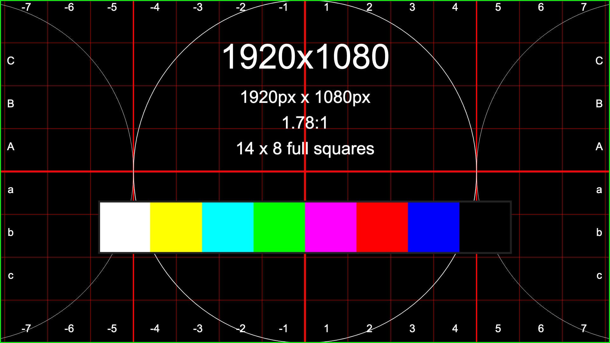

# Example Markdown Document

This document is created to test various Markdown features and their support when generating a PDF using the Docsify plugin with jsPDF.

## Table of Contents

- [Headings](#headings)
- [Paragraphs](#paragraphs)
- [Emphasis](#emphasis)
- [Lists](#lists)
- [Links](#links)
- [Images](#images)
- [Tables](#tables)
- [Code Blocks](#code-blocks)
- [Blockquotes](#blockquotes)
- [Horizontal Rule](#horizontal-rule)
- [Page Breaks](#page-breaks)
- [Inline HTML](#inline-html)
- [Text Alignment](#text-alignment)
- [UTF-8 and Emoji Support](#utf-8-and-emoji-support)


[Inline HTML](#inline-html)

## Headings

# H1 Heading

## H2 Heading

### H3 Heading

#### H4 Heading
  <!-- Portrait -->
##### H5 Heading

###### H6 Heading
  <!-- Portrait -->

## Paragraphs

This is a simple paragraph. Lorem ipsum dolor sit amet, consectetur adipiscing elit. Sed do eiusmod tempor incididunt ut labore et dolore magna aliqua.


This is another paragraph with a  

line break.

  <!-- Portrait -->  

## Emphasis

- *Italic*  
- **Bold**  
- ***Bold and Italic***  
- ~~Strikethrough~~

## Lists

### Unordered List

- Item 1
  - Subitem 1
  - Subitem 2
- Item 2
- 
- Item 3

### Ordered List

1. First item
2. Second item
   1. Subitem 1
   2. Subitem 2
   3. 
3. Third item

## Links

[Docsify GitHub](https://github.com/docsifyjs/docsify)  
[Relative Link](README.md)


## Images

* 
*   
* 

## Tables

### Tables 1
Tables are fully supported, including tables with embedded images:

| Header 1 | Header 2 | Header 3 |
|----------|----------|----------|
| 10      | 20      | 30        |


### Tables 2 

| Header 1 | Header 2 | Header 3 |
|----------|----------|----------|
| 10      | 20      | 30        |
| 40      | 50      | 60        | 


### Tables 

| Header 1 | Header 2 | Header 3 |
|----------|----------|----------|
|  |         |           |
|         |         |           | 


Tables will be formatted with alternating row colors and properly handle images inside cells.
Images in tables are automatically resized to fit within their cells while maintaining aspect ratio.

## SVG Support

SVG images are fully supported but don't preserve vector graphics in the PDF, they are rasterized:


You can include SVG images both inline and in tables:

| Header 1 | Header 2 |
|----------|----------|
|  | Regular text |

SVGs maintain their vector quality regardless of scaling, unlike raster images that can become pixelated.

## Code Blocks

### Inline Code

Here is some `inline code`.


### Block Code

```javascript
function helloWorld() {
    console.log("Hello, world!");
}
```

## Blockquotes

> This is a blockquote.
> It can span multiple lines.

## Horizontal Rule

---

## Page Breaks and LaTeX Commands

This PDF generator supports LaTeX-style commands wrapped in HTML comments for document formatting.

### Page Breaks

To insert a page break:

<!-- \newpage -->

Everything after this command will start on a new page in the PDF.

### Vertical Space

To add vertical space:

<!-- \vspace{15} -->

This adds 15mm of vertical space.

### Text Styling

Bold text:

<!-- \textbf{This text will be bold} -->

Italic text:

<!-- \textit{This text will be italic} -->

Colored text:

<!-- \textcolor{red}{This text will be red} -->

### Text Alignment

Center-align the following content:

<!-- \centering -->

This text will be centered.

Left-align the text (default):

<!-- \raggedright -->

This text will be left-aligned.

Right-align the text:

<!-- \flushright -->

This text will be right-aligned.

Justified text:

<!-- \justify -->

This text will be justified, with more even spacing between words to create straight edges on both the left and right.

### Horizontal Lines

Insert a horizontal line:

<!-- \hline -->


<!-- \newpage -->

## Text Alignment Examples

Default text is left-aligned like this paragraph. This is a longer paragraph to demonstrate the alignment. Lorem ipsum dolor sit amet, consectetur adipiscing elit. Sed do eiusmod tempor incididunt ut labore et dolore magna aliqua.

<!-- \centering -->

This paragraph should be center-aligned. This is a longer paragraph to demonstrate the alignment. Lorem ipsum dolor sit amet, consectetur adipiscing elit. Sed do eiusmod tempor incididunt ut labore et dolore magna aliqua.

<!-- \flushright -->

This paragraph should be right-aligned. This is a longer paragraph to demonstrate the alignment. Lorem ipsum dolor sit amet, consectetur adipiscing elit. Sed do eiusmod tempor incididunt ut labore et dolore magna aliqua.

<!-- \raggedright -->

This paragraph should be back to left-aligned (the default). This is a longer paragraph to demonstrate the alignment. Lorem ipsum dolor sit amet, consectetur adipiscing elit. Sed do eiusmod tempor incididunt ut labore et dolore magna aliqua.

<!-- \justify -->

This paragraph should be justified. This is a longer paragraph to demonstrate the alignment. Lorem ipsum dolor sit amet, consectetur adipiscing elit. Sed do eiusmod tempor incididunt ut labore et dolore magna aliqua. Ut enim ad minim veniam, quis nostrud exercitation ullamco laboris nisi ut aliquip ex ea commodo consequat.

## UTF-8 and Emoji Support

### Emoji Tests

Here are some common emojis to test PDF rendering support:

😀 😃 😄 😁 😆 😅 😂 🤣 🥲 ☺️ 😊 

🥰 😍 🤩 😘 😗 😚 😙 🥲 😋 😛 

🚗 🚕 🚙 🚌 🚎 🏎 🚓 🚑 🚒 🚐 🚚 

🪻 🪷 🌸 💮 🏵️ 🌹 🥀 🌺 🌻 🌼 🌷 

### Special Character Tests

Unicode symbols and special characters:
• ♠ ♣ ♥ ♦ ★ ☆ ☺ ☻
• © ® ™ ℠ § ¶ † ‡
• ½ ⅓ ¼ ⅕ ⅙ ⅐ ⅛ ⅑ ⅒
• α β γ δ ε ζ η θ
• Á É Í Ó Ú Ý á é í ó ú ý
• Ç Ñ Ü ç ñ ü

### Complex Scripts

Arabic: السلام عليكم ومرحبا بك

Hebrew: שלום וברוכים הבאים

Thai: สวัสดีและยินดีต้อนรับ

Japanese: こんにちは、ようこそ

Chinese: 你好，欢迎

Korean: 안녕하세요, 환영합니다

Russian: Здравствуйте и добро пожаловать

Greek: Γεια σας και καλώς ήρθατε

Devanagari (Hindi): नमस्ते और आपका स्वागत है

### Mathematical Symbols

Math expressions:
• ∞ ∫ ∑ ∏ √ ∂ ∇ ∈ ∉ 
• ≠ ≈ ≡ ≤ ≥ ⊂ ⊃ ⊆ ⊇
• ∧ ∨ ∀ ∃ ∄ ∴ ∵

## LaTeX Command Reference

| Command | Description | Example |
|---------|-------------|---------|
| `\newpage` | Start a new page | `<!-- \newpage -->` |
| `\vspace{size}` | Add vertical space (in mm) | `<!-- \vspace{10} -->` |
| `\hline` | Add horizontal line | `<!-- \hline -->` |
| `\textbf{text}` | Bold text | `<!-- \textbf{bold text} -->` |
| `\textit{text}` | Italic text | `<!-- \textit{italic text} -->` |
| `\textcolor{color}{text}` | Colored text | `<!-- \textcolor{red}{colored text} -->` |
| `\centering` | Center align text | `<!-- \centering -->` |
| `\raggedright` or `\flushleft` | Left align text | `<!-- \raggedright -->` |
| `\raggedleft` or `\flushright` | Right align text | `<!-- \flushright -->` |
| `\justify` | Justify text | `<!-- \justify -->` |

## Inline HTML

<div style="color: blue;">
  This is a div with blue text.
</div>