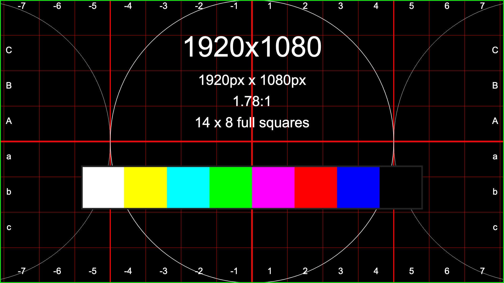

# Docsify-pdf-generate

## create a button to generate PDF client side

stuff that should go in pdf


## embeding image

with text
> quote
> 
> test2
> 
> test3

```bash
echo lol
```
* é è ÷ * 
* 😎
* ₧₪№↨בּשּׂ؟⇶♚❂☈☃ ҉ↂ✂❧☠℥




# Nested Title 1  


some text here

## Nested Title 2


some other text here

### Nested Title 3


some different text here

#### Nested Title 4


some extra text here

##### Nested Title 5


some text also here

###### Nested Title 6


Finaly some text here 


